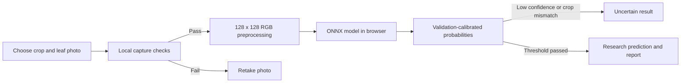

# LeafLens — crop leaf disease classification

## Outcome

A working research prototype for tomato, potato and maize, covering nine crop-specific classes. A compact CNN and pretrained MobileNetV2 were trained locally on CPU. **MobileNetV2** was selected by validation macro-F1, exported to ONNX, and integrated into browser-local inference.

The held-out PlantVillage result is **98.37% accuracy** and **98.46% macro-F1** on 1285 images. These are dataset results, not a claim of field diagnosis accuracy.

## Problem and scope

Use leaf photographs to screen for selected crop conditions and support early investigation. The model covers healthy / early blight / Septoria for tomato, healthy / early blight / late blight for potato, and healthy / common rust / northern blight for maize. Roots, fruits, other diseases and pest identification are outside scope. SDG 2 is the project motivation; SIH26131 is a user-supplied reference, not a verified affiliation.

## Architecture

No image is sent to an inference server. Runtime and model assets are served with the static website. Google Fonts may make a separate font request. No account, payment system, database or embedded hardware is needed.

## Data and experiment design

PlantVillage revision `7f7ecc7e1eaca78107e3affe7cb5abd9427e139a`. Of 9,853 downloaded images, 8,489 were retained: 5,919 training, 1,285 validation and 1,285 test. Missing or ambiguous tomato leaf records account for 1,364 exclusions. Full class counts, hashes and source URLs are in the dataset manifest. Publisher labels were used without expert relabeling.

Tomato and potato use recorded leaf groups. Maize lacks publisher leaf IDs and has provisional image-level splits; same-leaf leakage remains possible. Exact byte and pixel overlap was checked across splits, but this does not prove independence of every near-duplicate. The original tomato split was preserved.

The scratch CNN has four stride-2 convolution blocks (16, 32, 64, 96 channels), batch normalization, ReLU, global average pooling and dropout; 80,057 parameters. It uses rotation, flips and brightness augmentation only during training. MobileNetV2 starts from Torchvision IMAGENET1K_V2 weights; preceding blocks are frozen, while the final convolution block and classifier are fine-tuned on original and horizontal-flipped training views. Both use class-weighted cross entropy and the same manifest. Healthy potato has only 104 training images. Run configs and epoch histories record exact settings.

Input images are EXIF-oriented RGB, resized to 128 × 128. CNN input is scaled to [-1,1]; MobileNet uses ImageNet mean/std. Python and the browser use matching antialiased bilinear resizing with 22-bit coefficient rounding, verified against a Pillow reference. Image decoder/color-management differences can still cause small variation. ONNX tensor-level parity was verified on nine validation samples (maximum logit error 0.00000668). Browser tests separately check actual photo inference.

## Validation comparison

| Model run | Validation accuracy | Validation macro-F1 |
| --- | ---: | ---: |
| baseline-v1 | 97.43% | 95.95% |
| mobilenet-v1 | 98.52% | 98.06% |

Selection used validation macro-F1, not test performance. Temperature 1 and confidence threshold 0.5 were chosen using validation data only. The threshold searches for maximum validation coverage with at least 95% observed accepted accuracy and at least 100 accepted samples. That criterion is not a statistical guarantee or an unknown-image detector.

## Reserved test results

| Class | Test images | Precision | Recall | F1 |
| --- | ---: | ---: | ---: | ---: |
| tomato_healthy | 152 | 98.06% | 100.00% | 99.02% |
| tomato_early | 152 | 97.28% | 94.08% | 95.65% |
| tomato_septoria | 152 | 95.97% | 94.08% | 95.02% |
| potato_healthy | 24 | 100.00% | 100.00% | 100.00% |
| potato_early | 152 | 96.82% | 100.00% | 98.38% |
| potato_late | 152 | 98.68% | 98.68% | 98.68% |
| maize_healthy | 174 | 99.43% | 100.00% | 99.71% |
| maize_rust | 179 | 100.00% | 100.00% | 100.00% |
| maize_northern_blight | 148 | 100.00% | 99.32% | 99.66% |

Overall accuracy: 98.37%; macro precision: 98.47%; macro recall: 98.46%; macro-F1: 98.46%.

Confidence-only acceptance coverage: 99.84%. Accepted accuracy: 98.44%. This evaluation runs the classifier on dataset images; it does not include the browser capture-quality gate or user crop choices. Per-crop metrics and confusion matrix are available in `test_metrics.json`.

## Separate external benchmark

PlantDoc revision `5467f6012d78d1c446145d5f582da6096f852ae8`, using its publisher test split. Four clearly mapped conditions were included: tomato early blight, tomato Septoria, potato early blight and potato late blight. Five unsupported tomato conditions were included as an additional stress test. This data was never used for training, checkpoint selection, calibration or threshold tuning.

After excluding 0 exact duplicates, the supported cohort contains 36 images: **25.00% accuracy** and **22.67% macro-F1 over the four represented classes**. Of 41 unsupported-disease images, **22 still passed the confidence/crop acceptance rule**. These results show why a high PlantVillage score must not be presented as broad real-world reliability.

This is a small internet-sourced, cropped-image benchmark, not a prospective farm trial or a verified smartphone study. It covers neither healthy classes nor maize. Near-duplicate/source overlap and label noise cannot be ruled out. Separate synthetic black/white/noise probes are in the run folder; those probes are not representative real-world negatives.

## Limitations and next research work

- Independent farm/phone-photo trials and agricultural expert validation remain outstanding.
- Maize backgrounds differ substantially by class, and leaf grouping is unknown. Investigate background sensitivity and obtain better provenance.
- A high probability does not establish that an image is a leaf or belongs to one of the nine classes. A trained, evaluated out-of-scope detector needs additional representative negative data.
- Healthy potato has only 24 test images, so its score has substantial sampling uncertainty.
- Confidence is calibrated on PlantVillage validation data, not across all camera and field conditions.
- No pesticide dosage, purchase recommendation or definitive diagnosis is generated.

## Reproduce

See the root README for environment setup and the ordered preparation, training, final evaluation, external evaluation and export commands. Saved run names are immutable by default to avoid accidental overwrites. Do not repeatedly tune after viewing test/external results; a changed research iteration needs a fresh independent evaluation.

## Sources and attribution

- PlantVillage: https://github.com/spMohanty/PlantVillage-Dataset — Mohanty, Hughes and Salathe; publisher declares CC BY-SA 3.0.
- PlantDoc: https://github.com/pratikkayal/PlantDoc-Dataset — Singh et al., PlantDoc (CODS-COMAD 2020); publisher declares CC BY 4.0.
- MobileNetV2 weights/API: https://docs.pytorch.org/vision/main/models/generated/torchvision.models.mobilenet_v2.html
- PyTorch transfer learning: https://docs.pytorch.org/tutorials/beginner/transfer_learning_tutorial
- ONNX Runtime Web: https://onnxruntime.ai/docs/tutorials/web/ — pinned runtime 1.23.2, MIT license included under `dist/vendor/`.

Model SHA-256: `762a4ed282e773874ee7909345260c315d00f7552f08b12ee795cc33c9e8d541`.
